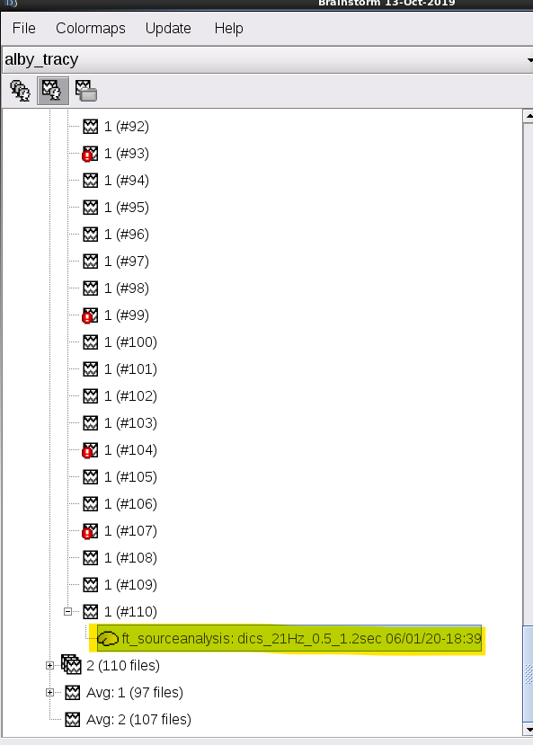

# DICS-beamformer-for-Brainstorm
This is a DICS beamformer implementation for the Brainstorm (BS) software package.

The dynamic imaging of coherent sources (DICS) beamformer technique that enables the study of cortical sources of oscillatory activation in frequency-domain (Gross et al., 2001). DICS is a linearly constrained minimum variance beamformer in the frequency domain. It estimates the covariance matrix to calculate the spatial filter using the sensor-level cross-spectral density (CSD) matrix and applies the filter to the sensor-level CSD to reconstruct the source-level CSDs of pairwise voxel activations, and this provides coherence measures between the source pairs.
This implementation has mainly focused on localizing induced activations due to task-MEG responses, eg, an overt language experient.

To run the DICS-BF in BS
1. Add "process_ft_sourceanalysis_DICS_BF.m" to the following BS directory, '../brainstorm3/toolbox/process/functions/'
2. drag and drop trials responses to the processing window

3. Select the DICS-BF source modelling from the process selection/Source/FieldTrrip: ft_souceanalysis DICS-BF vXX

4. Pipline estimate time-frequncy resposnses,

5. Choosing the time intervals, post-vs-pre. suggestion is provided based on gloab power spression of induced resposnes.
- eg, [-0.3,0;0.7,1.2]
<!--  -->
6. Choosing the frequncy of intervals, post vs pre, a suggestion is provided based on gloab power spression of induced resposnes.
- eg, f=22Hz
<!--  -->
<!--  -->
7. results are save in the last trial,

8. A sample comparison of DICS-BF against dSPM source model,

# Sources
1. Gross J, Kujala J, Hamalainen M, Timmermann L, Schnitzler A, Salmelin R. Dynamic imaging of coherent sources: Studying neural interactions in the human brain. Proc Natl Acad Sci U S A. 2001;98(2):694–9.
