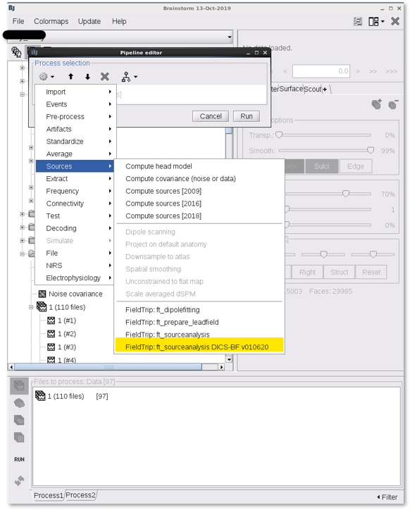

# DICS-beamformer-for-Brainstorm
This is a DICS beamformer implementation for the Brainstorm (BS) software package.

The dynamic imaging of coherent sources (DICS) beamformer technique that enables the study of cortical sources of oscillatory activation in frequency-domain (Gross et al., 2001). DICS is a linearly constrained minimum variance beamformer in the frequency domain. It estimates the covariance matrix to calculate the spatial filter using the sensor-level cross-spectral density (CSD) matrix and applies the filter to the sensor-level CSD to reconstruct the source-level CSDs of pairwise voxel activations, and this provides coherence measures between the source pairs.

This implementation has mainly meant to provide robust localization of oscillatory dynamics due to task MEG activations.
Below are details on how to run the DICS-BF in BS,
1. Add "process_ft_sourceanalysis_DICS_BF.m" to the following BS directory, '../brainstorm3/toolbox/process/functions/'
2. drag and drop trials responses to the processing window
<!--  -->

3. Choosing DICS-BF source modelling
<!--  -->
4. Pipline estimate time-frequncy resposnses,
<!--  -->
5. Choosing the time intervals, post-vs-pre. suggestion is provided based on gloab power spression of induced resposnes.
<!--  -->
6. Choosing the frequncy of intervals, post vs pre, a suggestion is provided based on gloab power spression of induced resposnes.
<!--  -->
<!--  -->

