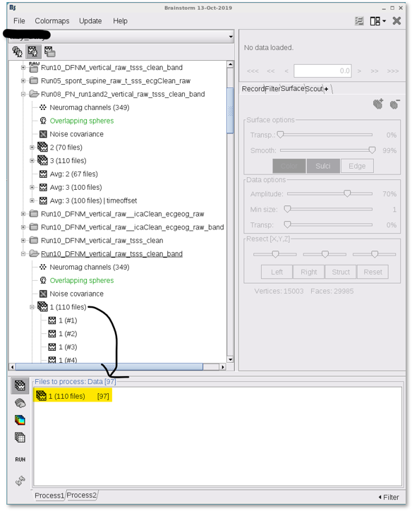

# DICS-beamformer-for-Brainstorm
This is a DICS beamformer implementation for the Brainstorm (BS) software package. The dynamic imaging of coherent sources (DICS) beamformer technique enables the study of cortical sources of oscillatory activation in frequency-domain (Gross et al., 2001). DICS is a linearly constrained minimum variance beamformer in the frequency domain. It estimates the covariance matrix to calculate the spatial filter using the sensor-level cross-spectral density (CSD) matrix and applies the filter to the sensor-level CSD to reconstruct the source-level CSDs of pairwise voxel activations, and this provides coherence measures between the source pairs.

This implementation has mainly focused on localizing induced activations due to task-MEG responses, eg, an overt definition naming language experiment.

To run the DICS-BF in BS,
1. Copy "process_ft_sourceanalysis_DICS_BF.m" to BS directory, '../brainstorm3/toolbox/process/functions/'
2. Open Brainstorm
3. Add (preprocessed epoched) trial responses to the processing window, 

4. Select the DICS-BF source modelling from the process selection/Source/FieldTrrip: ft_souceanalysis DICS-BF, vXX, and Run,  

5. Choose DICS beamformer as source model, MEG (or MEG MAG, or MEG GRAD) as sensor type, 

6. Pipline estimates time-frequncy resposnses (sensor-space, average across all sensors),  

7. Select the time interval of post-vs-pre responses, eg, [-0.3,0;0.7,1.2] 
8. Select the frequency of interest, eg, f=22Hz; A dpss smoothing window of 4Hz is applied (by default, see vy_fft, line 656) to estimate cross-spectral density (CSD) matrix 
9. Results after saving can be viewed in the last trial response. 

10. A sample result (an auditory definition naming task) based on DICS-BF against dSPM source model is provided below: 

For further inquiries please contact, vyoussofzadeh@mcw.edu

# Sources
1. Gross J, Kujala J, Hamalainen M, Timmermann L, Schnitzler A, Salmelin R. Dynamic imaging of coherent sources: Studying neural interactions in the human brain. Proc Natl Acad Sci U S A. 2001;98(2):694–9.

<!--  -->
<!--  -->
<!--  -->
