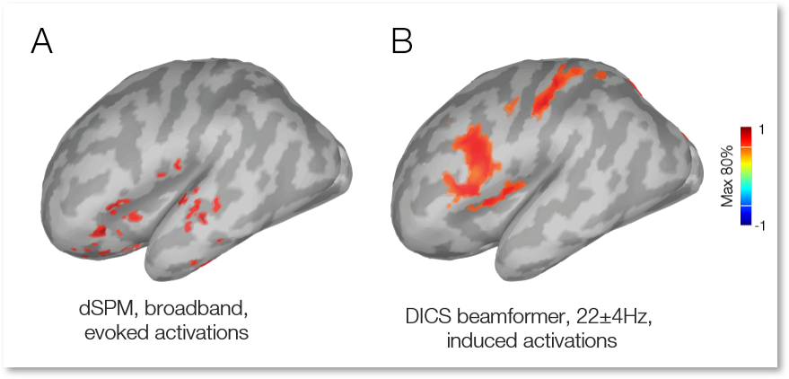

# DICS-beamformer-for-Brainstorm
This is a DICS beamformer implementation for the Brainstorm (BS) software package. The dynamic imaging of coherent sources (DICS) beamformer technique enables the study of cortical sources of oscillatory activation in frequency-domain (Gross et al., 2001). DICS is a linearly constrained minimum variance beamformer in the frequency domain. It estimates the covariance matrix to calculate the spatial filter using the sensor-level cross-spectral density (CSD) matrix and applies the filter to the sensor-level CSD to reconstruct the source-level CSDs of pairwise voxel activations, and this provides coherence measures between the source pairs.

This implementation has mainly focused on localizing induced activations due to task-MEG responses, eg, an overt definition naming language experiment.

Before running,
- Add Fieldtrip toolbox to the Matlab path, eg, ft_path = 'xx/fieldtrip_20190419'; addpath(ft_path); ft_defaults;
- Estimate headmodel: overlapping spheres for surface-based and MRI volume for volumetric-based source mapping;
- Estimate noise co-variance form trial responses: pipeline needs these details for initial settings only.

To run the DICS-BF in BS,
1. Copy "process_ft_sourceanalysis_DICS_BF.m" to BS directory, '../brainstorm3/toolbox/process/functions/'
2. Open Brainstorm
3. Add (preprocessed epoched) trial responses to the processing window, 

4. Select the DICS-BF source modeling from the process selection/Source/FieldTrrip: ft_souceanalysis DICS-BF, vXX, and Run,  

5. Choose DICS-beamformer as the source modeling approach, and MEG (MEG-MAG, or MEG GRAD) as the sensor type, 

6. Pipeline estimates time-frequency responses (sensor-space, average across all sensors),  

7. Select the time interval of post-vs-pre responses, eg, [-0.3,0;0.7,1.2] 
8. Select the frequency of interest, eg, f=22Hz; A dpss smoothing window of 4Hz is applied (by default, see vy_fft, line 656) to estimate cross-spectral density (CSD) matrix 
9. Results (surface map) are stored in the last trial response. 

10. A sample result, an auditory definition naming task, DICS-BF compared against a dynamic Statistical Parametric Maps (dSPM), broadband 0.1-28Hz, is provided below.  

For further inquiries please contact, vyoussofzadeh@mcw.edu

# Cite
1. Gross J, Kujala J, Hamalainen M, Timmermann L, Schnitzler A, Salmelin R. Dynamic imaging of coherent sources: Studying neural interactions in the human brain. Proc Natl Acad Sci U S A. 2001;98(2):694–9.
2. Youssofzadeh, V., Stout, J., Ustine, C., Gross, W.L., Lisa, L., Humphries, C.J., Binder, J.R., Raghavan, M., 2020. Mapping language from MEG beta power modulations during auditory and visual naming, NeuroImage. Elsevier Inc. https://doi.org/10.1016/j.neuroimage.2020.117090

# Notes
- The pipeline by default investigates the desynchrony effects (power suppression effects, active < baseline). You might be interested in synchrony effects (active > baseline). If so, please uncomment lines 374-375 and comment out line 376 to have an option for both analyses. 

# Updates
- On 06/0621, a new version of the pipeline [process_ft_sourceanalysis_dics.m](https://github.com/vyoussofzadeh/DICS-beamformer-for-Brainstorm/blob/master/ft_sourceanalysis_dics.m) was added to the repository. For convenience and compatibility, variable inputs were integrated into a BS option GUI interface. The [process_ft_sourceanalysis_DICS_BF.m](https://github.com/vyoussofzadeh/DICS-beamformer-for-Brainstorm/tree/master/Older%20version) should produce the same results as the new version.
   

<!--  -->
<!--  -->
<!--  -->
